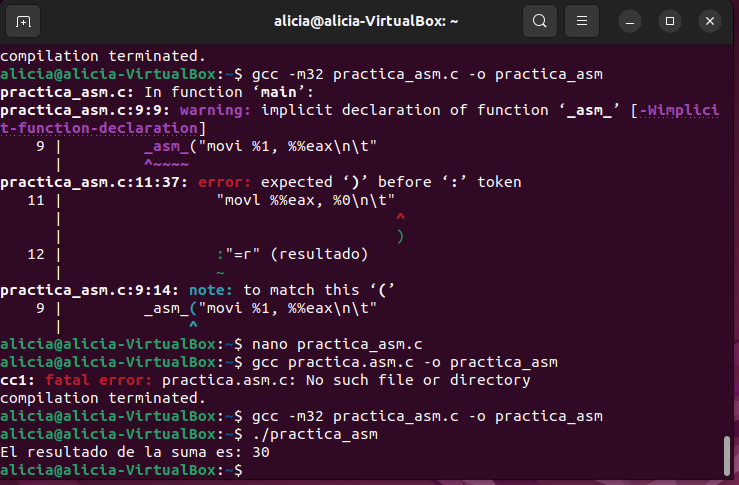

# Práctica: Análisis del Proceso de Compilación en C y Ensamblador en Línea (ASM)

## 1. Crear el archivo del código fuente

Crea y abre un archivo llamado `practica_asm.c` usando el editor **nano** directamente en la terminal:

```bash
nano practica_asm.c
```

Pega el siguiente código dentro del editor:

```c
#include <stdio.h>

int main(void) {
    int a = 10;
    int b = 20;
    int resultado = 0;

    // Bloque asm en línea para sumar dos variables
    __asm__ (
        "movl %1, %%eax\n\t"
        "addl %2, %%eax\n\t"
        "movl %%eax, %0\n\t"
        : "=r" (resultado) // Salida (%0)
        : "r" (a), "r" (b)  // Entradas (%1, %2)
        : "%eax"           // Registro modificado
    );

    printf("El resultado de la suma es: %d\n", resultado);
    return 0;
}

```

* Para guardar: **`Ctrl + O`** y luego **`Enter`** 
* Para salir: **`Ctrl + X`** 

## 3. Compilar el programa

Agregar librería

```
sudo apt update && sudo apt install gcc-multilib g++-multilib -y
```

Compilar 

```bash
gcc -m32 practica_asm.c -o practica_asm
```

## 4. Ejecutar el binario

```bash
./practica_asm
```

**Salida en pantalla:**

```text
El resultado de la suma es: 30
```



## 5. Conclusión

* **Integración C + Ensamblador:** Se comprobó que el bloque `__asm__` permite ejecutar instrucciones x86 directamente dentro de un programa en C, combinando la facilidad de control de flujo de C con la precisión de bajo nivel de Ensamblador.
* **Manejo de Registros:** Se observó cómo el compilador gestiona los registros de la CPU (`%eax`) mediante las secciones de entrada (`"r"`), salida (`"=r"`) y modificación (`clobber list`), garantizando que la transferencia de datos entre variables y registros sea segura.
* **Rendimiento y Control:** La práctica demuestra que el ensamblador en línea es una herramienta clave cuando se requiere acceso directo al hardware, optimizaciones extremas de velocidad o el uso de instrucciones específicas de la arquitectura que C no ofrece por defecto.