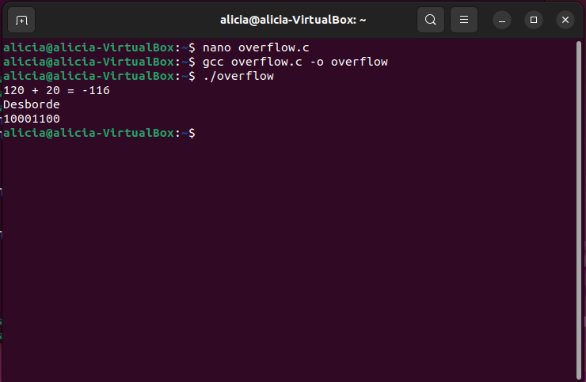

# Práctica: Análisis de Desbordamiento de Memoria (Integer Overflow) en C

# PARTE 1: Introducción y Caso Básico de Desbordamiento

## 1.1 Introducción y Código Fuente Inicial
En esta primera fase se analizó el fenómeno de desbordamiento de entero (*Integer Overflow*) al trabajar con tipos de datos de tamaño fijo de 8 bits (`int8_t`).

### Código Desarrollado (`overflow.c`) - Versión 1
```c
#include <stdio.h>
#include <stdint.h>

int main() {
    int8_t a = 120, b = 20;
    int8_t resultado = a + b;

    printf("%d + %d = %d\n", a, b, resultado);

    return 0;
}
```

## 1.2 Secuencia de Comandos Ejecutados
1. **Creación y edición:**
   ```bash
   nano overflow.c
   ```
2. **Guardado en `nano`:** `Ctrl + O` -> `Enter` -> `Ctrl + X`.
3. **Verificación de archivos:**
   ```bash
   ls
   ```
   *Resultado:* `overflow.c`
4. **Compilación:**
   ```bash
   gcc overflow.c -o overflow
   ```
5. **Ejecución:**
   ```bash
   ./overflow
   ```

## 1.3 Resultado de la Parte 1
```text
120 + 20 = -116
```

## 1.4 Explicación Técnica (Parte 1)
El tipo `int8_t` almacena valores en el rango de **-128 a 127**. La suma de $120 + 20 = 140$ supera el límite máximo representable ($127$), provocando un desbordamiento hacia los números negativos en complemento a 2 (dando como resultado $-116$).

---

# PARTE 2: Detección Lógica de Desbordamiento y Representación en Bits

## 2.1 Código Fuente Actualizado (`overflow.c`) - Versión 2
En esta segunda parte, se actualizó el programa para incorporar la detección condicional de desbordamientos utilizando las constantes `INT8_MAX` / `INT8_MIN` y la inspección de bits individuales mediante una unión (`union`) y campos de bits (`struct`).

```c
#include <stdio.h>
#include <stdint.h>

typedef union {
    unsigned char byte;
    struct {
        unsigned char b0 : 1; /* Bit menos significativo (LSB) */
        unsigned char b1 : 1;
        unsigned char b2 : 1;
        unsigned char b3 : 1;
        unsigned char b4 : 1;
        unsigned char b5 : 1;
        unsigned char b6 : 1;
        unsigned char b7 : 1; /* Bit más significativo (MSB) */
    } bits;
} Reg8Bits;

int main() {
    int8_t a = 120, b = 20;
    int8_t resultado = a + b;

    printf("%d + %d = %d\n", a, b, resultado);

    /* Detección de Desbordamiento (Overflow) */
    if (a > 0 && b > 0) {
        if (a > INT8_MAX - b) {
            printf("Desborde\n");
        }
    }
    if (a < 0 && b < 0) {
        if (a < INT8_MIN + b) {
            printf("Desborde\n");
        }
    }

    /* Impresión de los bits individuales */
    Reg8Bits miDato;
    miDato.byte = resultado;
    printf("%d%d%d%d%d%d%d%d\n",
           miDato.bits.b7, miDato.bits.b6,
           miDato.bits.b5, miDato.bits.b4,
           miDato.bits.b3, miDato.bits.b2,
           miDato.bits.b1, miDato.bits.b0);

    return 0;
}
```

## 2.2 Secuencia de Comandos Ejecutados en la Parte 2
1. **Edición para actualizar el código:**
   ```bash
   nano overflow.c
   ```
2. **Recompilación del ejecutable:**
   ```bash
   gcc overflow.c -o overflow
   ```
3. **Ejecución del ejecutable actualizado:**
   ```bash
   ./overflow
   ```

## 2.3 Resultado Obtenido en Pantalla (Parte 2)
```text
120 + 20 = -116
Desborde
10001100
```

## 2.4 Explicación Técnica (Parte 2)
1. **Detección Condicional:** La condición `a > INT8_MAX - b` evalúa de forma segura si la suma superará el valor $127$ antes de que ocurra la pérdida de rango, imprimiendo correctamente el aviso `"Desborde"`.
2. **Análisis Bit a Bit:** La unión `Reg8Bits` mapea el byte en memoria del valor resultado ($-116$). La secuencia impresa `10001100` representa exactamente el valor binario en complemento a dos de $-116$, con el bit de signo `b7 = 1`.


   