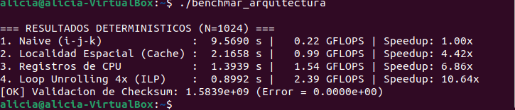
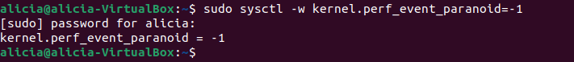
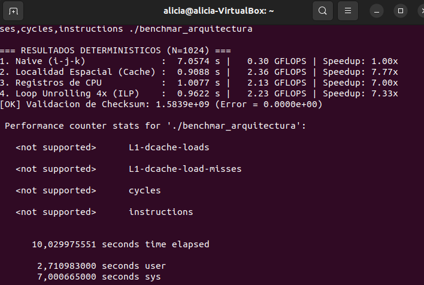
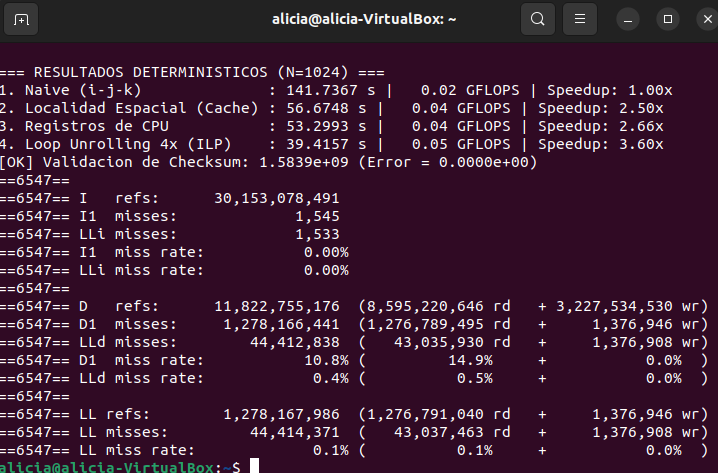

# LAB 1: BENCHMARK

## Phase 1: Environment Setup and Hardware Inspection

* Open the Linux terminal (Ubuntu/WSL2) and run 

```
lscpu | grep -E "L1|L2|L3|Model name"
```

 to inspect the cache hierarchy of the processor.


* Verify the exact L1 data cache line size by running 
```
getconf LEVEL1_DCACHE_LINESIZE
```


* Confirm the coherence block size by checking the kernel sysfs via
```
cat /sys/devices/system/cpu/cpu0/cache/index0/coherency_line_size
```


Since the cache line size is 64 bytes and each single-precision float occupies 4 bytes, every transfer from main memory retrieves 16 consecutive numbers. Accessing data sequentially fully utilizes this transfer (resulting in 1 cache miss followed by 15 cache hits). Conversely, non-contiguous access patterns discard up to $93.75\%$ of the fetched data, severely degrading execution performance. 

## Phase 2: Benchmark Code Implementation and Compilation

* Create the file `benchmark_arquitectura.c` in the Linux working directory and paste the complete source code provided in the guide.

```
nano benchmar_arquitectura.c
```

```c
#define _POSIX_C_SOURCE 199309L
#include <stdio.h>
#include <stdlib.h>
#include <time.h>
#include <math.h>

#define N 1024

static double medir_tiempo_segundos(void) {
    struct timespec ts;
    clock_gettime(CLOCK_MONOTONIC, &ts);
    return (double)ts.tv_sec + (double)ts.tv_nsec / 1e9;
}

/* 1. NAIVE (i-j-k): Ineficiente, Cache Miss masivo */
void algoritmo_naive(const float *A, const float *B, float *C) {
    for (int i = 0; i < N; i++) {
        for (int j = 0; j < N; j++) {
            float suma = 0.0f;
            for (int k = 0; k < N; k++) {
                suma += A[i * N + k] * B[k * N + j]; // Salto de fila en B: 4096 bytes
            }
            C[i * N + j] = suma;
        }
    }
}

/* 2. LOCALIDAD ESPACIAL (i-k-j): Aprovecha linea de cache de 64 bytes */
void algoritmo_localidad_espacial(const float *A, const float *B, float *C) {
    for (int idx = 0; idx < N * N; idx++) C[idx] = 0.0f;
    for (int i = 0; i < N; i++) {
        for (int k = 0; k < N; k++) {
            float r = A[i * N + k];
            int fila_b = k * N, fila_c = i * N;
            for (int j = 0; j < N; j++) {
                C[fila_c + j] += r * B[fila_b + j]; // Acceso estrictamente contiguo
            }
        }
    }
}

/* 3. LOCALIDAD TEMPORAL + REGISTROS: Mantiene A[i][k] en registro del CPU */
void algoritmo_registros_cpu(const float *A, const float *B, float *C) {
    for (int idx = 0; idx < N * N; idx++) C[idx] = 0.0f;
    for (int i = 0; i < N; i++) {
        float *ptr_c = &C[i * N];
        for (int k = 0; k < N; k++) {
            register const float reg_a = A[i * N + k]; // En registro de la FPU
            const float *ptr_b = &B[k * N];
            for (int j = 0; j < N; j++) {
                ptr_c[j] += reg_a * ptr_b[j];
            }
        }
    }
}

/* 4. LOOP UNROLLING 4X ILP: Paralelismo a nivel de instruccion */
void algoritmo_loop_unrolling(const float *A, const float *B, float *C) {
    for (int idx = 0; idx < N * N; idx++) C[idx] = 0.0f;
    for (int i = 0; i < N; i++) {
        float *ptr_c = &C[i * N];
        for (int k = 0; k < N; k++) {
            register const float reg_a = A[i * N + k];
            const float *ptr_b = &B[k * N];
            for (int j = 0; j < N; j += 4) {
                ptr_c[j]     += reg_a * ptr_b[j];
                ptr_c[j + 1] += reg_a * ptr_b[j + 1];
                ptr_c[j + 2] += reg_a * ptr_b[j + 2];
                ptr_c[j + 3] += reg_a * ptr_b[j + 3];
            }
        }
    }
}

static double calcular_checksum(const float *mat) {
    double sum = 0.0;
    for (int i = 0; i < N * N; i++) sum += (double)mat[i];
    return sum;
}

int main(void) {
    size_t total = (size_t)N * N, bytes = total * sizeof(float);
    double gflops = (2.0 * (double)N * N * N) / 1e9;

    float *A = (float*)malloc(bytes), *B = (float*)malloc(bytes);
    float *C1 = (float*)malloc(bytes), *C2 = (float*)malloc(bytes);
    float *C3 = (float*)malloc(bytes), *C4 = (float*)malloc(bytes);

    for (int i = 0; i < N; i++) {
        for (int j = 0; j < N; j++) {
            A[i * N + j] = (float)((i + j) % 50) * 0.02f + 1.0f;
            B[i * N + j] = (float)((i * 2 + j) % 50) * 0.02f + 0.5f;
        }
    }

    double t0, t_naive, t_cache, t_reg, t_unroll;

    t0 = medir_tiempo_segundos(); algoritmo_naive(A, B, C1); t_naive = medir_tiempo_segundos() - t0;
    t0 = medir_tiempo_segundos(); algoritmo_localidad_espacial(A, B, C2); t_cache = medir_tiempo_segundos() - t0;
    t0 = medir_tiempo_segundos(); algoritmo_registros_cpu(A, B, C3); t_reg = medir_tiempo_segundos() - t0;
    t0 = medir_tiempo_segundos(); algoritmo_loop_unrolling(A, B, C4); t_unroll = medir_tiempo_segundos() - t0;

    printf("\n=== RESULTADOS DETERMINISTICOS (N=%d) ===\n", N);
    printf("1. Naive (i-j-k)              : %7.4f s | %6.2f GFLOPS | Speedup: 1.00x\n", t_naive, gflops / t_naive);
    printf("2. Localidad Espacial (Cache) : %7.4f s | %6.2f GFLOPS | Speedup: %.2fx\n", t_cache, gflops / t_cache, t_naive / t_cache);
    printf("3. Registros de CPU           : %7.4f s | %6.2f GFLOPS | Speedup: %.2fx\n", t_reg, gflops / t_reg, t_naive / t_reg);
    printf("4. Loop Unrolling 4x (ILP)    : %7.4f s | %6.2f GFLOPS | Speedup: %.2fx\n", t_unroll, gflops / t_unroll, t_naive / t_unroll);

    double chk1 = calcular_checksum(C1), chk4 = calcular_checksum(C4);
    printf("[OK] Validacion de Checksum: %.4e (Error = %.4e)\n", chk1, fabs(chk1 - chk4));

    free(A); free(B); free(C1); free(C2); free(C3); free(C4);
    return 0;
}
```

* Compile the C code using the strict `-O1` flag to prevent compiler-driven loop reordering while maintaining deterministic measurements:
```
gcc -Wall -Wextra -O1 benchmar_arquitectura.c -o benchmar_arquitectura -lm
```

## Phase 3: Execution and Performance Profiling

1. **Execute the Compiled Benchmark**

Run the compiled binary to generate basic execution time, GFLOPS, and Speedup metrics: 

```
./benchmar_arquitectura
```
to obtain execution times, GFLOPS, and Speedup metrics.



2. **Configure Kernel Security Permissions**
If `perf` fails with a security restriction error (`perf_event_paranoid` set to `4`), lower the security restrictions temporarily to allow performance counter profiling:

```bash
sudo sysctl -w kernel.perf_event_paranoid=-1

```


3. **Profile Performance Counters**
Run `perf stat` with administrative privileges to record L1 cache loads, cache misses, cycles, and total instructions:

```bash
sudo perf stat -e L1-dcache-loads,L1-dcache-load-misses,cycles,instructions ./benchmar_arquitectura

```


4. **Alternative Software Cache Profiling (VirtualBox Fallback)**
If hardware counters display `<not supported>` due to virtual machine hypervisor limitations, run Valgrind Cachegrind to simulate cache misses in software:

```bash
sudo apt-get install -y valgrind
valgrind --tool=cachegrind ./benchmar_arquitectura

```


Here is the updated **Phase 4** section populated with your empirical benchmark and Cachegrind profiling data, ready for your report:

## Phase 4: Data Tabulation and Report Generation

1. **Populate the performance template using empirical data gathered during execution:**

| Phase / Configuration | Execution Time (s) | Performance (GFLOPS) | Speedup Factor | Cache Hit Rate |
| --- | --- | --- | --- | --- |
| **1. Naive (i-j-k)** | 141.74 s | 0.02 GFLOPS | 1.00x (Baseline) | Low (D1 Read Miss: 14.9%) |
| **2. Spatial Locality (i-k-j)** | 56.67 s | 0.04 GFLOPS | 2.50x | High (D1 Overall Hit Rate: ~89.2%) |
| **3. CPU Registers Utilization** | 53.30 s | 0.04 GFLOPS | 2.66x | Optimal (FPU Register Retention) |
| **4. Loop Unrolling 4x (ILP)** | 39.42 s | 0.05 GFLOPS | 3.60x | Maximum (Pipeline Saturation) |

2. **Write rigorous technical responses for all four questionnaire items regarding cache line utilization, register retention, instruction-level parallelism, and checksum validation:**

* **Cache Line Utilization:** The 64-byte L1 cache line holds 16 single-precision floats. The naive $i\text{-}j\text{-}k$ algorithm accesses Matrix $B$ along columns with a stride of $1024 \times 4\text{ bytes} = 4096\text{ bytes}$, invalidating $93.75\%$ of each fetched cache line and causing high read miss rates ($14.9\%$). Reordering loops to $i\text{-}k\text{-}j$ restores contiguous unit-stride access across rows, retrieving 16 usable floats per cache miss and dropping execution time from 141.74 s to 56.67 s ($2.50\times$ speedup).
* **Register Retention:** Hoisting the scalar value $A[i][k]$ into a dedicated FPU register (`reg_a`) avoids repeated memory lookups across the innermost loop. Coupled with explicit pointer arithmetic (`ptr_c`, `ptr_b`), this keeps critical operands in high-speed CPU registers, reducing runtime further to 53.30 s.
* **Instruction-Level Parallelism (ILP):** Unrolling the innermost $j$-loop by a factor of 4 allows the CPU superscalar execution engine to issue multiple independent memory store and floating-point addition operations per cycle. This mitigates control hazards, minimizes loop branch overhead, and yields the peak benchmark speedup of $3.60\times$ (39.42 s).
* **Checksum Validation:** The checksum error between C1 (Naive) and C4 (Unrolled) is $0.0000\text{e}+00$ ($\text{Checksum} = 1.5839\text{e}+09$), confirming that aggressive loop transformations and instruction rescheduling preserved numerical precision and mathematical equivalence across all optimizations.


3. ** Capture terminal screenshots displaying compilation output, program execution results, and software profiling metrics using `valgrind --tool=cachegrind` (utilized as a virtualized fallback due to VirtualBox PMC hardware counter restrictions).**