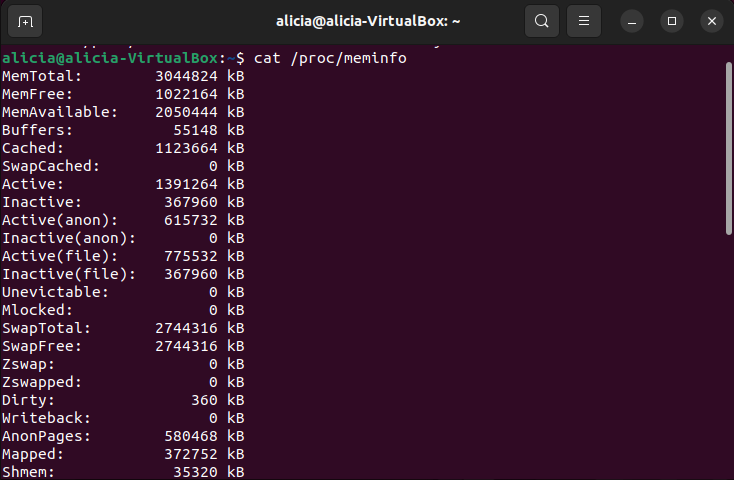
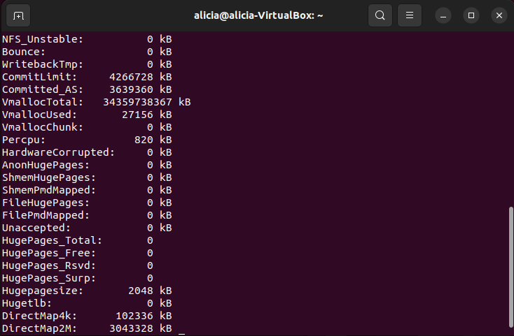
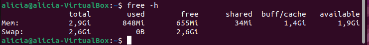
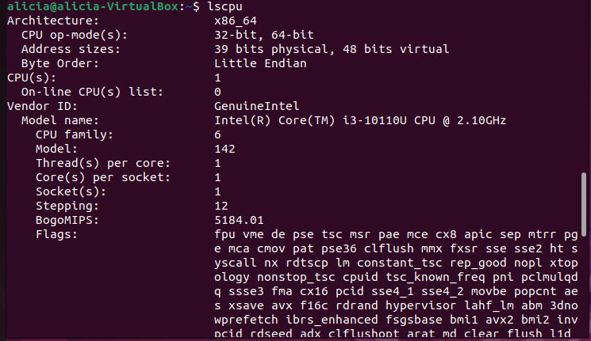
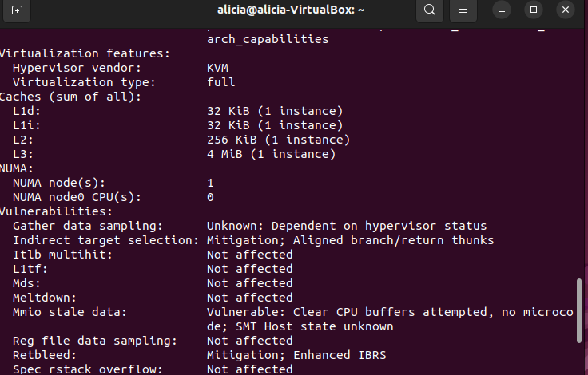
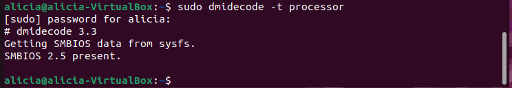

# Comandos de Diagnóstico de Hardware y Memoria en Linux

## 1. Introducción

El objetivo de esta documentación es guiar la ejecución y análisis de los comandos de consola en Linux para la inspección de hardware (CPU) y estado de memoria RAM en el sistema operativo.


## 2. Comandos de Inspección de Memoria RAM

### 2.1. `cat /proc/meminfo`

* **Acción:** Muestra información detallada sobre el uso de la memoria del sistema leyendo directamente el archivo pseudo-filesystem `/proc/meminfo`.


* **Sintaxis:**
```bash
cat /proc/meminfo

```




* **Campos principales a analizar:**
* `MemTotal`: Memoria RAM total disponible.
* `MemFree`: Memoria RAM física que no se está utilizando.
* `MemAvailable`: Estimación de cuánta memoria está disponible para iniciar nuevos procesos sin intercambiar (swap).
* `Buffers` / `Cached`: Memoria utilizada por el kernel para almacenamiento en caché de disco.


### 2.2. `free -h`

* **Acción:** Presenta un resumen legible por humanos (parámetro `-h` o *human-readable*) de la memoria física y Swap.


* **Sintaxis:**
```bash
free -h

```


* **Salida esperada:**
Muestra una tabla con columnas como `total`, `used`, `free`, `shared`, `buff/cache` y `available` expresadas en MB o GB.

## 3. Comandos de Inspección del Procesador (CPU)

### 3.1. `lscpu`

* **Acción:** Recolecta e imprime la arquitectura de la CPU actual (números de núcleos, sockets, subprocesos/threads, cachés L1/L2/L3) desde `sysfs` y `/proc/cpuinfo`.


* **Sintaxis:**
```bash
lscpu

```





* **Información relevante:**
* `Architecture`: Arquitectura del procesador (p. ej., x86_64).
* `CPU(s)`: Número total de núcleos lógicos.
* `Model name`: Nombre completo y modelo del procesador comercial.

### 3.2. `sudo dmidecode -t processor`

* **Acción:** Extrae información sobre la CPU directamente de las tablas DMI / SMBIOS de la placa madre. Requiere privilegios de superusuario (`sudo`).


* **Sintaxis:**
```bash
sudo dmidecode -t processor

```


* **Información relevante:**
* Fabricante y versión del socket del procesador.
* Velocidad máxima soportada vs. velocidad actual.
* Estado del socket (Populated/Empty).


## 4. Conclusión y Beneficio

La ejecución de estos comandos permite a los administradores de sistemas diagnosticar cuellos de botella de rendimiento, comprobar la capacidad física instalada frente a la detectada por el Kernel y optimizar el uso de recursos.