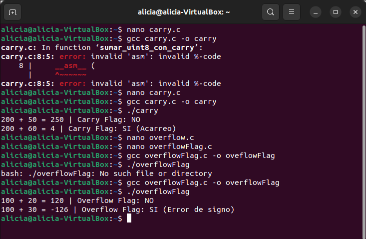

# OVERFLOW FLAGS

## 1. Código Fuente en C (`overflowFlag.c`)

```c
#include <stdio.h>
#include <stdint.h>
#include <stdbool.h>

bool sumar_int8_con_overflow(int8_t a, int8_t b, int8_t *resultado) {
    unsigned char overflow_flag;

    __asm__ (
        "addb %[val_b], %[val_a]\n\t" // Suma con signo de 8 bits
        "seto %[of]\n\t"              // of = 1 si OF == 1
        : [val_a] "+q" (a),
          [of] "=q" (overflow_flag)
        : [val_b] "q" (b)
        : "cc"
    );

    *resultado = a;
    return (bool)overflow_flag;
}

int main() {
    int8_t res;

    // Caso 1: Dentro del rango (-128 a 127) -> 100 + 20 = 120
    bool hay_overflow = sumar_int8_con_overflow(100, 20, &res);
    printf("100 + 20 = %d | Overflow Flag: %s\n", res, hay_overflow ? "SI" : "NO");

    // Caso 2: Desbordamiento de signo -> 100 + 30 = 130 (sobrepasa 127, se envuelve a -126)
    hay_overflow = sumar_int8_con_overflow(100, 30, &res);
    printf("100 + 30 = %d | Overflow Flag: %s\n", res, hay_overflow ? "SI (Error de signo)" : "NO");

    return 0;
}
```

## 2. Crear el Archivo de C

Usar cualquier editor de texto por terminal como `nano` o `gedit`:

```bash
nano overflowFlag.c

```

Pegar el código anterior dentro del archivo, guardar (`Ctrl + O`, presionar `Enter`) y salir (`Ctrl + X`).


## 4. Compilación del Programa

Compilar  el archivo `.c` usando **GCC**:

```bash
gcc overflowFlag.c -o overflowFlag

```

## 5. Ejecución del Programa

Ejecutar el programa compilado desde la terminal:

```bash
./overflowFlag

```

### Salida esperada en la terminal:

```text
100 + 20 = 120 | Overflow Flag: NO
100 + 30 = -126 | Overflow Flag: SI (Error de signo)
```
