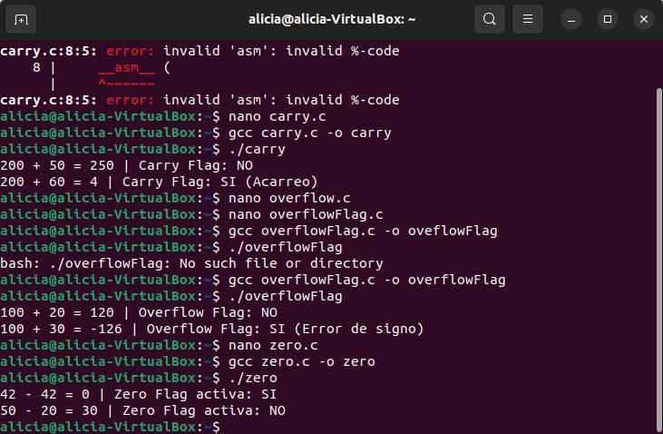

# ZERO FLAG

## 1. Código Fuente en C (`zero.c`)

```c
#include <stdio.h>
#include <stdbool.h>

bool restar_y_detectar_zero(int a, int b, int *resultado) {
    unsigned char zero_flag;

    __asm__ (
        "subl %[val_b], %[val_a]\n\t" // val_a = val_a - val_b (actualiza banderas)
        "setz %[zf]\n\t"              // zf = 1 si ZF == 1, de lo contrario 0
        : [val_a] "+r" (a),           // Entrada/Salida: 'a' almacena el resultado
          [zf] "=q" (zero_flag)       // Salida: captura de la bandera ZF
        : [val_b] "r" (b)             // Entrada: 'b'
        : "cc"                        // Informa al compilador que cambiamos las banderas (condition codes)
    );

    *resultado = a;
    return (bool)zero_flag;
}

int main() {
    int res;

    // Caso 1: Los valores son iguales (activa ZF)
    bool es_cero = restar_y_detectar_zero(42, 42, &res);
    printf("42 - 42 = %d | Zero Flag activa: %s\n", res, es_cero ? "SI" : "NO");

    // Caso 2: Los valores son distintos (no activa ZF)
    es_cero = restar_y_detectar_zero(50, 20, &res);
    printf("50 - 20 = %d | Zero Flag activa: %s\n", res, es_cero ? "SI" : "NO");

    return 0;
}

```

## 2. Crear el Archivo de C

Usar cualquier editor de texto por terminal como `nano` o `gedit`:

```bash
nano zero.c

```

Pegar el código anterior dentro del archivo, guardar (`Ctrl + O`, presionar `Enter`) y salir (`Ctrl + X`).


## 4. Compilación del Programa

Compilar  el archivo `.c` usando **GCC**:

```bash
gcc zero.c -o zero

```

## 5. Ejecución del Programa

Ejecutar el programa compilado desde la terminal:

```bash
./zero

```

### Salida esperada en la terminal:

```text
42 - 42 = 0 | Zero Flag activa: SI
50 - 20 = 30 | Zero Flag activa: NO

```
