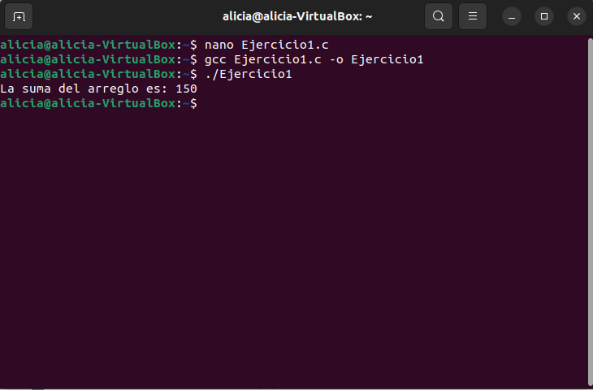

# Ejercicio 1

## 1. Código Fuente en C (`Ejercicio1.c`)

```c

#include <stdio.h>

int main() {
    // Declaración e inicialización del arreglo en memoria RAM
    int arreglo[] = {10, 20, 30, 40, 50};
    
    // Cálculo de la cantidad de elementos en el arreglo
    int longitud = sizeof(arreglo) / sizeof(arreglo[0]);
    
    // Variable acumuladora para almacenar la suma
    int suma = 0;

    // Recorrido del arreglo para sumar sus elementos
    for (int i = 0; i < longitud; i++) {
        suma += arreglo[i];
    }

    // Impresión del resultado
    printf("La suma del arreglo es: %d\n", suma);

    return 0;
}

```

## 2. Crear el Archivo de C

Usar cualquier editor de texto por terminal como `nano` o `gedit`:

```bash
nano Ejercicio1.c

```

Pegar el código anterior dentro del archivo, guardar (`Ctrl + O`, presionar `Enter`) y salir (`Ctrl + X`).


## 4. Compilación del Programa

Compilar  el archivo `.c` usando **GCC**:

```bash
gcc Ejercicio1.c -o Ejercicio1

```

## 5. Ejecución del Programa

Ejecutar el programa compilado desde la terminal:

```bash
./Ejercicio1

```

### Salida esperada en la terminal:

```text
La suma del arreglo es: 150
```

