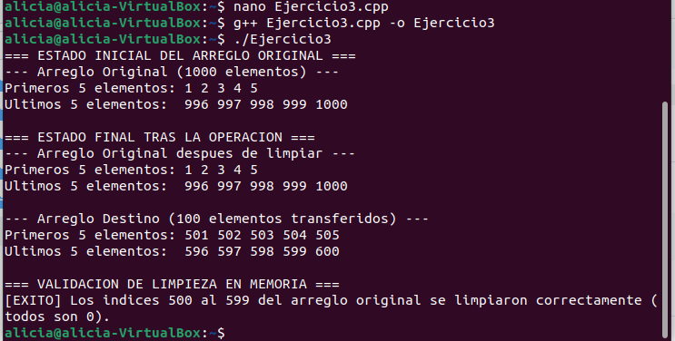

# Ejercicio 3

## 1. Código Fuente en C++ (`Ejercicio3.cpp`)

```cpp
#include <iostream>
#include <fstream>
#include <cstring>  // Para memcpy / memmove
#include <iomanip>

using namespace std;

// Función para imprimir los primeros y últimos 5 elementos de un arreglo
void imprimirExtremos(const int* arreglo, int tamano, const string& nombreArreglo) {
    cout << "--- " << nombreArreglo << " ---" << endl;
    cout << "Primeros 5 elementos: ";
    for (int i = 0; i < 5 && i < tamano; i++) {
        cout << arreglo[i] << " ";
    }
    cout << endl;

    cout << "Ultimos 5 elementos:  ";
    for (int i = tamano - 5; i < tamano; i++) {
        if (i >= 0) {
            cout << arreglo[i] << " ";
        }
    }
    cout << endl << endl;
}

int main() {
    const int TAM_GRANDE = 1000;
    const int TAM_PEQUENO = 100;
    const int INDICE_INICIO = 500;
    const int INDICE_FIN = 599;

    int arregloOriginal[TAM_GRANDE];
    int arregloDestino[TAM_PEQUENO];

    // 1. Simulación o lectura de datos desde memoria secundaria (archivo binario / texto)
    ofstream archivoSalida("memoria_secundaria.dat", ios::binary);
    for (int i = 0; i < TAM_GRANDE; i++) {
        int valor = i + 1; // Valores de 1 a 1000
        archivoSalida.write(reinterpret_cast<char*>(&valor), sizeof(int));
    }
    archivoSalida.close();

    // Lectura del archivo simulado (memoria secundaria)
    ifstream archivoEntrada("memoria_secundaria.dat", ios::binary);
    if (!archivoEntrada) {
        cerr << "Error al abrir el archivo de memoria secundaria." << endl;
        return 1;
    }

    archivoEntrada.read(reinterpret_cast<char*>(arregloOriginal), sizeof(int) * TAM_GRANDE);
    archivoEntrada.close();

    // Mostrar estado del arreglo original ANTES del traslado
    cout << "=== ESTADO INICIAL DEL ARREGLO ORIGINAL ===" << endl;
    imprimirExtremos(arregloOriginal, TAM_GRANDE, "Arreglo Original (1000 elementos)");

    // 2. Transferencia de datos (índices 500 al 599) usando memcpy
    memcpy(arregloDestino, &arregloOriginal[INDICE_INICIO], sizeof(int) * TAM_PEQUENO);

    // 3. Limpieza opcional del arreglo original (estableciendo a cero los elementos transferidos)
    memset(&arregloOriginal[INDICE_INICIO], 0, sizeof(int) * TAM_PEQUENO);

    // 4. Salidas por consola y validaciones
    cout << "=== ESTADO FINAL TRAS LA OPERACION ===" << endl;
    imprimirExtremos(arregloOriginal, TAM_GRANDE, "Arreglo Original despues de limpiar");
    imprimirExtremos(arregloDestino, TAM_PEQUENO, "Arreglo Destino (100 elementos transferidos)");

    // Validación de que los índices 500 al 599 del arreglo original estén en cero
    bool esCero = true;
    for (int i = INDICE_INICIO; i <= INDICE_FIN; i++) {
        if (arregloOriginal[i] != 0) {
            esCero = false;
            break;
        }
    }

    cout << "=== VALIDACION DE LIMPIEZA EN MEMORIA ===" << endl;
    if (esCero) {
        cout << "[EXITO] Los indices 500 al 599 del arreglo original se limpiaron correctamente (todos son 0)." << endl;
    } else {
        cout << "[ERROR] La limpieza de memoria fallo en algunos indices." << endl;
    }

    return 0;
}

```

## 2. Crear el Archivo de C++

Usar cualquier editor de texto por terminal como `nano` o `gedit`:

```bash
nano Ejercicio3.cpp

```

Pegar el código anterior dentro del archivo, guardar (`Ctrl + O`, presionar `Enter`) y salir (`Ctrl + X`).

## 3. Compilación del Programa

Compilar el archivo `.cpp` usando **G++**:

```bash
g++ Ejercicio3.cpp -o Ejercicio3

```

## 4. Ejecución del Programa

Ejecutar el programa compilado desde la terminal:

```bash
./Ejercicio3

```

### Salida esperada en la terminal:

```text
=== ESTADO INICIAL DEL ARREGLO ORIGINAL ===
--- Arreglo Original (1000 elementos) ---
Primeros 5 elementos: 1 2 3 4 5 
Ultimos 5 elementos:  996 997 998 999 1000 

=== ESTADO FINAL TRAS LA OPERACION ===
--- Arreglo Original despues de limpiar ---
Primeros 5 elementos: 1 2 3 4 5 
Ultimos 5 elementos:  996 997 998 999 1000 

--- Arreglo Destino (100 elementos transferidos) ---
Primeros 5 elementos: 501 502 503 504 505 
Ultimos 5 elementos:  596 597 598 599 600 

=== VALIDACION DE LIMPIEZA EN MEMORIA ===
[EXITO] Los indices 500 al 599 del arreglo original se limpiaron correctamente (todos son 0).

```

