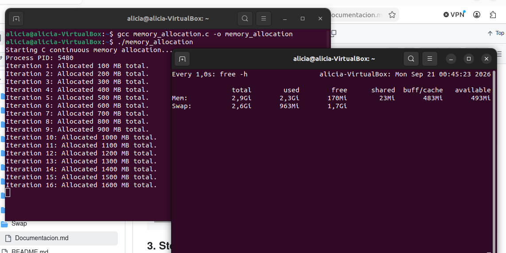
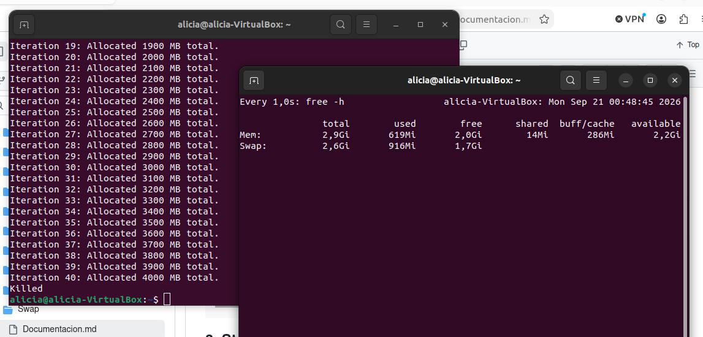

# Computer Architecture - Practical Assignment: RAM & Swap Memory Management

## 1. Source Code Implementation

```bash
nano memory_allocation.c
```

**C Implementation (`memory_allocation.c`)**

```c
#include <stdio.h>
#include <stdlib.h>
#include <string.h>
#include <unistd.h>

#define CHUNK_SIZE_MB 100

int main() {
    size_t chunk_bytes = (size_t)CHUNK_SIZE_MB * 1024 * 1024;
    size_t total_allocated_mb = 0;
    int iteration = 1;

    printf("Starting C continuous memory allocation...\n");
    printf("Process PID: %d\n", getpid());

    while (1) {
        // Allocate memory block
        char *ptr = (char *)malloc(chunk_bytes);
        
        if (ptr == NULL) {
            printf("\n[!] Memory allocation failed (malloc returned NULL).\n");
            break;
        }

        // Fill memory block with data to force OS physical page assignment
        memset(ptr, 'A', chunk_bytes);

        total_allocated_mb += CHUNK_SIZE_MB;
        printf("Iteration %d: Allocated %zu MB total.\n", iteration, total_allocated_mb);

        iteration++;
        usleep(500000); // Pause 0.5s for clear monitoring
    }

    return 0;
}

```

## 2. Compilation & Execution Commands

### Step 1: Open two terminal windows side-by-side

* **Terminal 1:** For monitoring system memory and swap usage.
* **Terminal 2:** For compiling and executing the program.

### Step 2: Set up monitoring (Terminal 1)

Run any of the following commands to observe RAM and Swap behavior in real time:

```bash
# Option 1: Live dynamic updates every second
watch -n 1 free -h

# Option 2: Interactive task manager (recommended)
htop

```

### Step 3: Compile and run (Terminal 2)

```bash
# Compile the C program
gcc memory_allocation.c -o memory_allocation

# Execute the program
./memory_allocation

```






## 3. Step-by-Step Documentation & Evidence Guide

### Process Steps:

1. **Initial Baseline:** Before running the script, check available RAM and Swap using `free -h`. Note the baseline values.
2. **Execution:** Launch the program in Terminal 2.
3. **RAM Consumption Phase:** Observe the `free -h` or `htop` screen in Terminal 1. As the allocated memory increases, available RAM gradually drops toward 0 MB.
4. **Swap Paging Phase:** Once RAM is full, the Linux kernel begins paging inactive or newly requested memory blocks into the **Swap partition/file**. Notice the `Swap` line in `free -h` or the Swap bar in `htop` start to increase from 0 MB upwards.
5. **Termination:** The process will eventually stop when Swap is filled (triggering the Linux *Out-Of-Memory (OOM) Killer*) or when manually terminated with `Ctrl + C`.

### Commands Used Summary Table

| Command | Purpose |
| --- | --- |
| `free -h` | Displays total, used, and free RAM and Swap space in human-readable format. |
| `watch -n 1 free -h` | Continuously refreshes memory stats every second to observe Swap activation. |
| `htop` or `top` | Interactive viewer for system processes, showing individual CPU, RAM, and Swap bars. |
| `gcc memory_allocation.c -o memory_allocation` | Compiles the C source code into an executable binary file. |
| `python3 memory_allocation.py` | Executes the Python memory allocation script. |
| `dmesg` | tail -n 20` | Checks system logs if the process is killed by the kernel OOM Killer. |